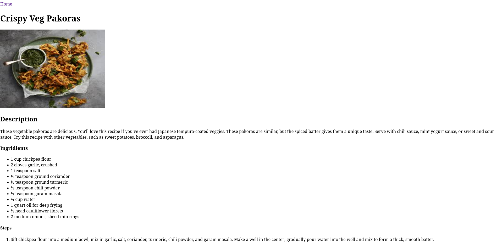
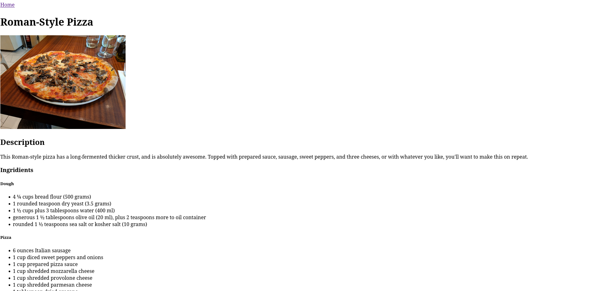
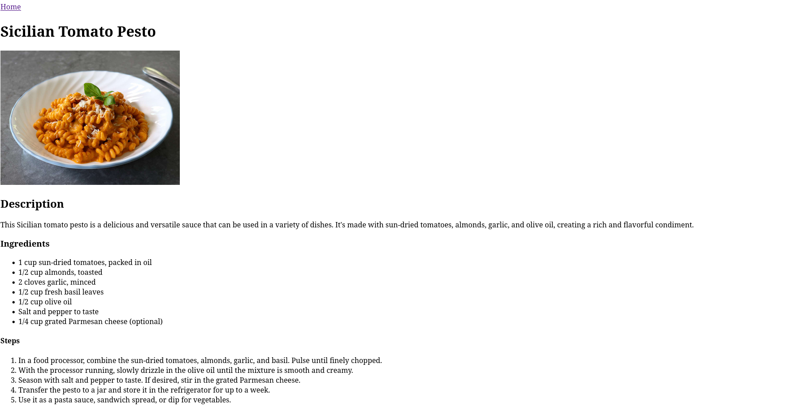

# Odin Recipes

A simple website to practice basic HTML and Git workflows, built as part of [The Odin Project](https://www.theodinproject.com/) foundational curriculum.

## 📚 Project Overview

This project is part of **The Odin Project's Foundations course**. It focuses on creating a basic HTML website from scratch and reinforcing core concepts like:

- Structuring an HTML document
- Using headings, paragraphs, links, images, and lists
- Working with Git and GitHub
- Creating multiple pages and linking them together

The final result is a simple recipes website with links to individual recipe pages.

## 🌐 Live Demo

🔗 [View the Website](https://github.com/Adi2329002/odin-recipes/) 

## 📁 Project Structure
```
odin-recipes/
|── README.md
|── index.html
├── recipes/
│ ├── Vegpakoras.html
│ ├── RomanPizza.html
│ └── Sicilianpesto.html
└── images/
├── vegpakoras.jpg
├── Romanpizza.jpg
└── pesto.jpg

```

## 🛠️ Built With

- HTML5
- Git & GitHub

  ## 📸 Screenshots

  
  
  

  # 🚀 Getting Started

To run this project locally:

```bash
git clone https://github.com/yourusername/odin-recipes.git
cd odin-recipes
open index.html


> Note: the inner code block uses triple backticks + `bash` for syntax highlighting.

### 8. **Lessons Learned / Future Improvements**
Reflect on what you learned and what you want to add next.

```markdown
## ✅ Lessons Learned

- Writing semantic HTML
- Git basics and commits
- File organization

## 📌 Future Improvements

- Add CSS styling
- Make it mobile-friendly

## 🙌 Acknowledgements

- [The Odin Project](https://www.theodinproject.com/)

---

Made with ❤️ by [Aditya Alok](https://github.com/Adi2329002)
